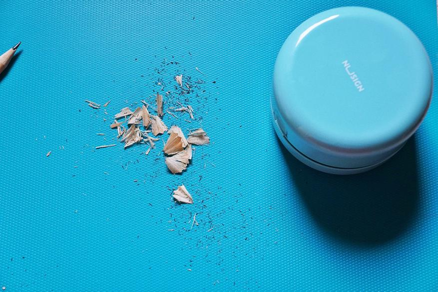
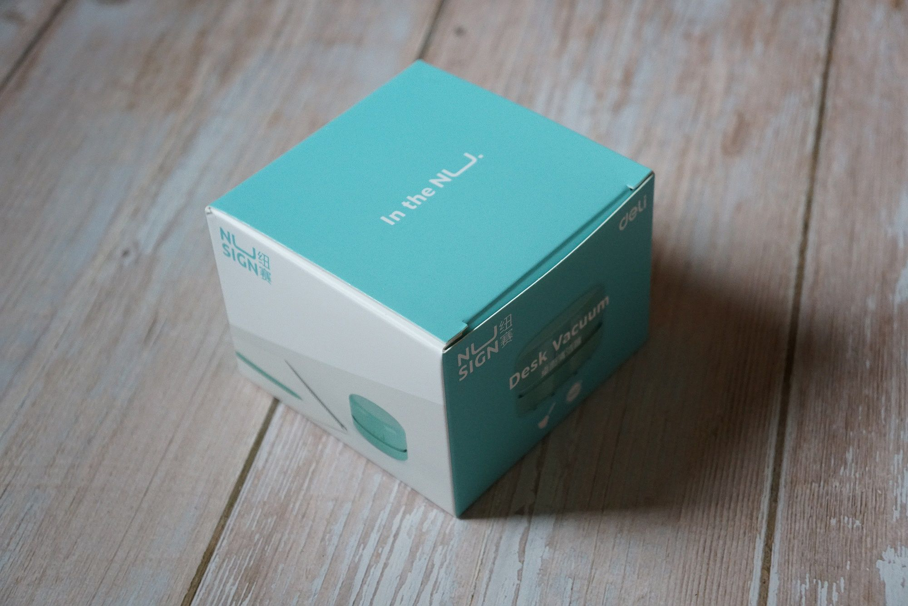
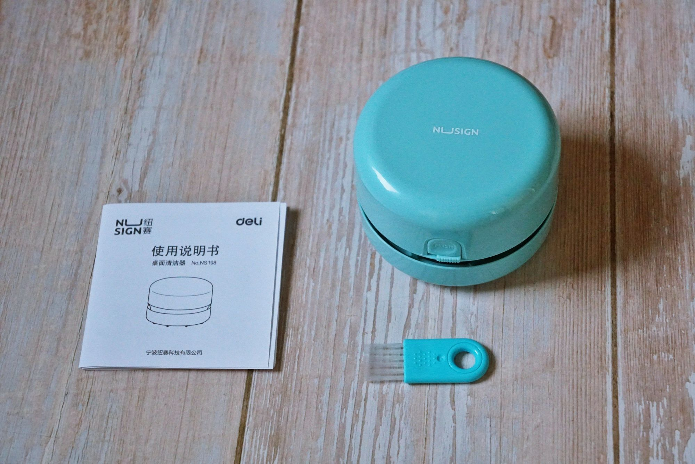
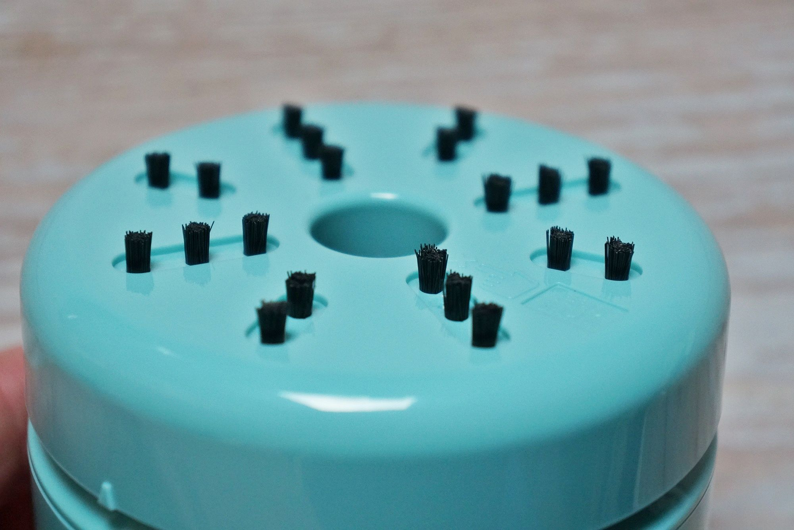

# Portable Tabletop Vacuum Cleaner

In this review we will talk about a very funny, but at the same time quite interesting and useful thing - a portable vacuum cleaner for cleaning the workplace. The device will be quite useful when engaged in a hobby, when the table is a lot of small debris or, for example, to accustom, in an unobtrusive form, the younger generation to maintain the order of the desk.

The device comes in a quality cardboard box. It is produced by the company Deli, a fairly well-known brand of quality and inexpensive stationery:

Inside, in a transparent package, there is the device itself, a brush for cleaning and instructions.

There are only four colors available for purchase on the product page: white, black, pink and blue. The device is a round cylinder, very reminiscent of a robot vacuum cleaner :)

 On the side there is an On/Off switch and a button to remove the top cover:
 

At the bottom, in the center, there is an opening through which the debris is sucked and from which eight rows of brushes (or brushes, as one likes) diverge. The bristles are about 5mm high and are made of stiff nylon. 
Between the parts of the body there is a notch, through which the suction air flow comes out.
 The device has several components. The upper cover covers the battery compartment and can be removed by pressing the PUSH button. 
The vacuum cleaner is powered by two AA batteries. 
To remove the bottom cover (the one with the brushes), you need to turn it relative to the middle part where the motor is located. 
To make the vacuum cleaner work, just insert the batteries and put the switch to the "ON" position. Vacuum cleaner has only one speed, however, it sucks very well, just spend a few times without pressure over the place of cleaning. Hard brushes help to separate "clings" to the surface of the eraser pieces. It takes a couple of seconds to clean. 

The device also copes with pencil cleaning without any problems:

It is clear that with such size a separate dust collector is not provided, all is accumulated directly in the compartment where the impeller rotates, which volume is small (stated 455 cubic cm), but quite sufficient for one or two cleanings. The device itself is not noisy, but when you get a large garbage, you hear how it grinds inside.
Note that the power was enough to grind some of the seeds and remove the husk (and it only worked for about 10 seconds). Well, and then just shake everything out and use the complete brush to finish cleaning the device.
In general, the device is unusual and interesting enough, pretending to be the smallest vacuum cleaner :). 
However, despite its size, the stated function of cleaning the workplace, performs well. It can be used as an original gift. 

